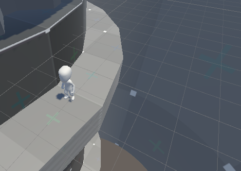
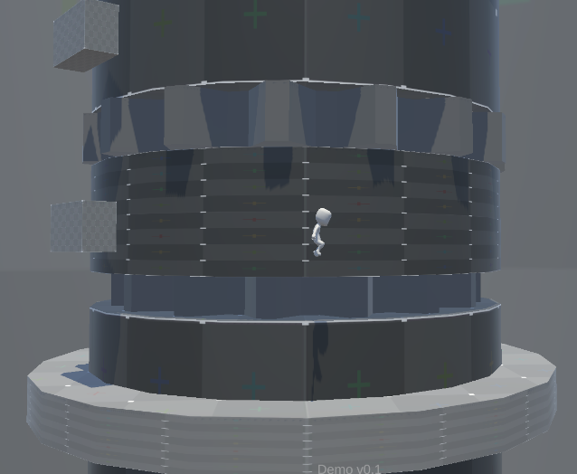
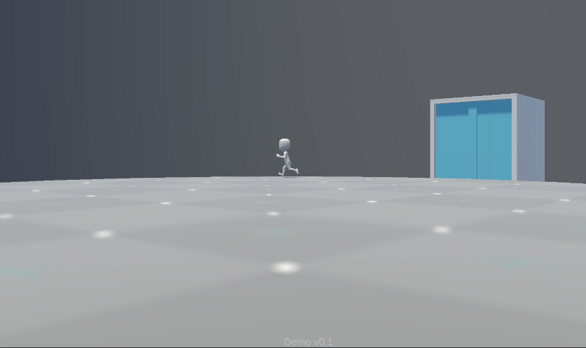

# TowerClimber - A platform game around a tower

# Status - Stop

I'm no longer maintaining because I feel like I want to get what I want, need a lot of art assets, and I think the gameplay doesn't seem very interesting (it was when I created the project)

# Gameplay

All of the game's physics revolves around the central tower, and when you press the space, the following three effects are executed in order:

1. Double Jump
2. Flash forward
3. Go back in 3 second

There is no any target you need to get,  just an effect display

I have developed indoor and outdoor movement effects, and the center position of the movement is different

